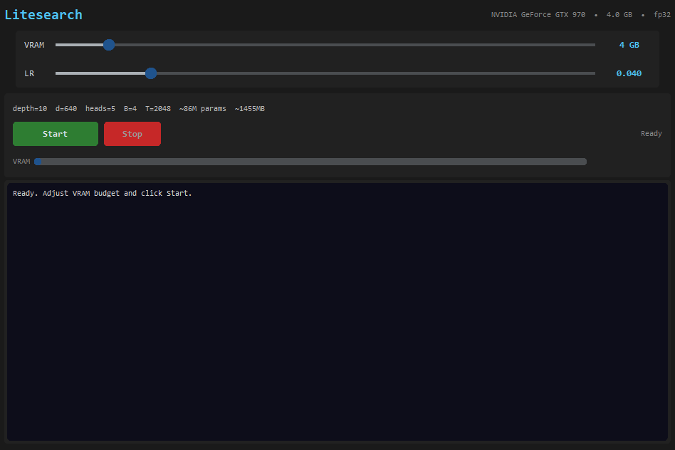

# Litesearch

*Fork of [autoresearch](https://github.com/karpathy/autoresearch) optimized for consumer GPUs (2GB–32GB+ VRAM) with a GUI.*

## What is this?

The idea: give an AI agent a small but real LLM training setup and let it experiment autonomously overnight. It modifies the code, trains for 5 minutes, checks if the result improved, keeps or discards, and repeats. You wake up in the morning to a log of experiments and (hopefully) a better model.

**Litesearch** adds:
- **Consumer GPU support**: Works on GTX 970 through RTX 4090+ (2GB–32GB+ VRAM)
- **Auto VRAM scaling**: Model size, batch size, and sequence length automatically fit your GPU
- **GUI dashboard**: CustomTkinter interface with live training log, VRAM bar, and config sliders
- **Pascal support**: Automatic fp32 fallback for GTX 10-series GPUs
- **Gradient checkpointing**: Always enabled to minimize memory usage

## Quick start

**Requirements:** A single NVIDIA GPU, Python 3.10+.

### Option A: pip (standard)

```bash
# 1. Create a virtual environment (recommended)
python -m venv .venv
# Windows:
.venv\Scripts\activate
# Linux/Mac:
source .venv/bin/activate

# 2. Install dependencies
pip install -r requirements.txt

# 3. Download data and train tokenizer (one-time, ~2 min)
python prepare.py

# 4a. Launch the GUI
python gui.py

# 4b. Or run headless (original autoresearch style)
python train.py
```

### Option B: uv (faster)

```bash
# 1. Install uv (if you don't already have it)
curl -LsSf https://astral.sh/uv/install.sh | sh

# 2. Install dependencies
uv sync

# 3. Download data and train tokenizer (one-time, ~2 min)
uv run prepare.py

# 4a. Launch the GUI
uv run gui.py

# 4b. Or run headless
uv run train.py
```

## The GUI



**Controls:**
- **VRAM slider**: Set your GPU's VRAM budget. The model auto-scales to fit, leaving 800MB for the OS.
- **Matrix LR slider**: Override the Muon optimizer learning rate (default 0.04).
- **Start**: Begins a training experiment with auto-computed config.
- **Stop**: Gracefully stops training after the current step.

## VRAM Auto-Scaling

The model automatically adapts to your GPU. Set the slider to your available VRAM:

| VRAM Budget | Depth | n_embd | Batch | Seq Len | ~Params | Est. VRAM |
|-------------|-------|--------|-------|---------|---------|-----------|
| 4 GB | 10 | 640 | 4 | 2048 | ~86M | ~1.4 GB |
| 8 GB | 16 | 1024 | 8 | 2048 | ~285M | ~4.6 GB |
| 16 GB | 20 | 1280 | 16 | 2048 | ~519M | ~7.5 GB |
| 32 GB | 24 | 1536 | 64 | 2048 | ~856M | ~15 GB |

Reserves 800MB for desktop/OS and uses 50% of remaining VRAM. Gradient checkpointing keeps activation memory low.

## Exporting models

After training, export the model as a `.pth` file (PyTorch format):

```bash
python train.py --export model.pth        # export after training
python train.py --export-dir exports/     # export to directory (auto-named)
```

The GUI also has an "Export" button (after training) and "Schedule" button (auto-export after N experiments).

## Running the agent (headless)

You can still use the original autoresearch agent workflow:

```
Hi have a look at program.md and let's kick off a new experiment!
```

The `program.md` file provides agent instructions. Point your agent here and let it go.

## Project structure

```
prepare.py      — constants, data prep + runtime utilities (do not modify)
train.py        — model, optimizer, training loop, VRAM auto-config (agent modifies this)
gui.py          — CustomTkinter dashboard (new)
program.md      — agent instructions
pyproject.toml  — dependencies
```

## Changes from autoresearch

- **FlashAttention-3 replaced** with `torch.nn.functional.scaled_dot_product_attention` (built-in, no extra dependencies)
- **Sliding window attention removed** — standard causal attention for maximum compatibility
- **Gradient checkpointing** always enabled — trades compute for memory
- **Pascal GPU support** — automatic fp32 fallback on GTX 10-series (pre-Turing)
- **Peak FLOPs lookup table** — accurate MFU calculation for any GPU
- **`kernels` dependency removed** — no custom CUDA kernel dependencies
- **`customtkinter` added** — for the GUI dashboard
- **`run_training()` function** — clean API for GUI integration
- **`compute_optimal_config()`** — automatic model sizing based on VRAM budget

## Platform support

| GPU | Status | Notes |
|-----|--------|-------|
| RTX 4090 / 4080 | ✅ | bfloat16, best performance |
| RTX 3090 / 3080 | ✅ | bfloat16 |
| RTX 2080 Ti | ✅ | bfloat16 |
| GTX 1080 Ti / 1080 | ✅ | fp32 fallback (~2x memory) |
| GTX 970 / 980 | ✅ | fp32, small models only |
| AMD / Intel | ❌ | Not supported (would need ROCm/XPU backend) |

## Notable forks

- [miolini/autoresearch-macos](https://github.com/miolini/autoresearch-macos) (MacOS)
- [trevin-creator/autoresearch-mlx](https://github.com/trevin-creator/autoresearch-mlx) (MacOS)
- [jsegov/autoresearch-win-rtx](https://github.com/jsegov/autoresearch-win-rtx) (Windows)
- [andyluo7/autoresearch](https://github.com/andyluo7/autoresearch) (AMD)

## License

MIT
